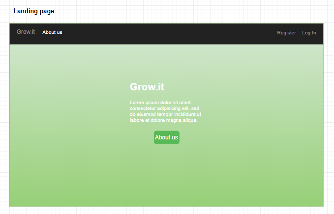
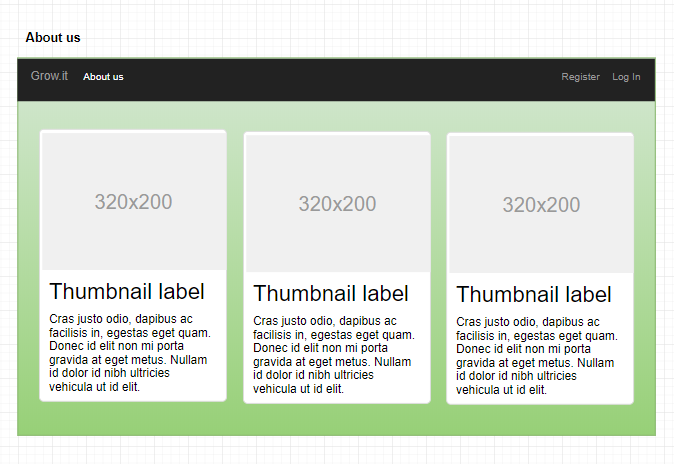
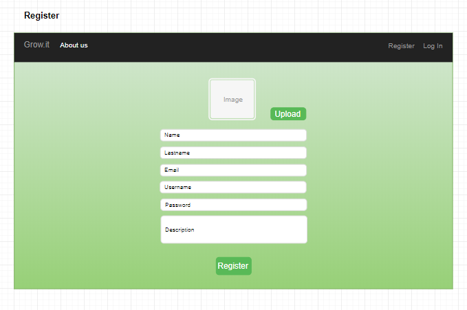
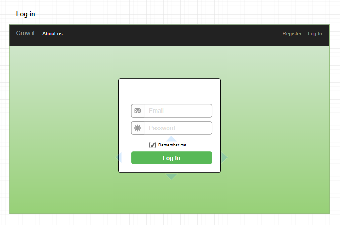
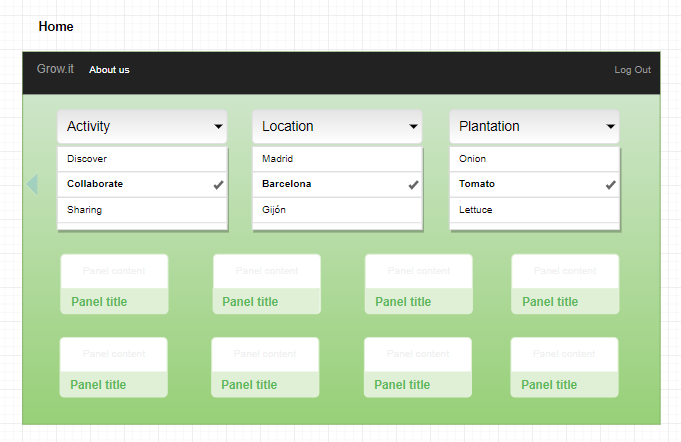
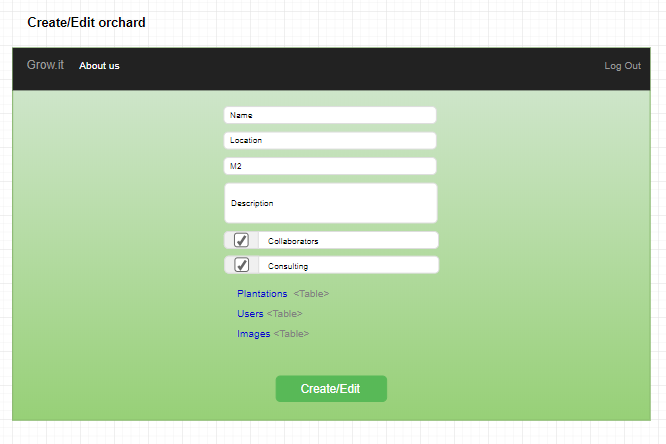
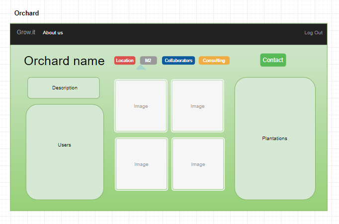
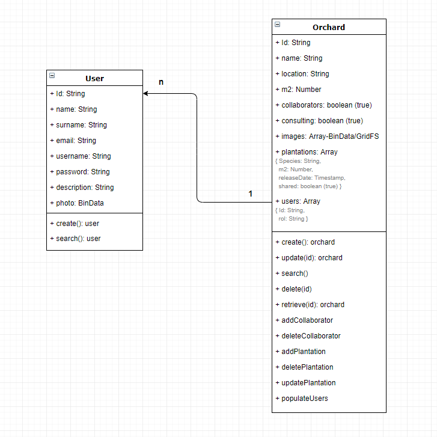
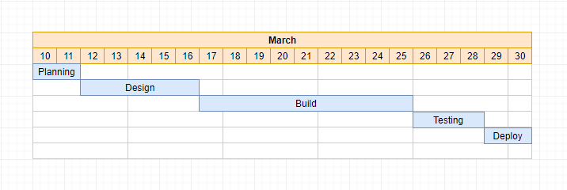

# Grow.it: grow more... buy less

                                                    

## Target

Grow it is a collaborative urban orchards platform.

-------------------------------------------------------

## Description

This application allows to connect people through a growing community of owned plantations. Once a user is registered, he can create an orchard or collaborate in another ones, look for consulting, share the harvest surplus, etc.

-------------------------------------------------------

## Technologies

* HTML5
* CSS3
* Javascript
* Jasmine
* Node
* MongoDB
* Mongoose
* React

-------------------------------------------------------

## Adittional information

### Mock up

-------------------------------------------------------

### Data model

-------------------------------------------------------

### Sprint plan

|    Fecha   |  Planificación  |
|------------|-----------------|
| 2018-03-09 | Kick-off meeting | 
| 2018-03-12 | Documented README.MD, with datamodel, mockup & sprint plan | 
| 2018-03-14 | Doc improvements, design & build front-end | 
| 2018-03-16 | Read-only appp deployed to surge, no-funcional React components implementation, API server y MongoDB defined| 
| 2018-03-19 | React functionality: basic funtions. TDD API testing | 
| 2018-03-21 | React functionality: advanced funtions & bug fixes. Functional connection between entre Front-end, API Server and MongoDB | 
| 2018-03-23 | Basic functional application deployed | 
| 2018-03-28 | Improvements, bug testing, hotfixes | 
| 2018-03-30 | Demo day | 

-------------------------------------------------------

### Links
* Gestión de tareas en [Trello](https://trello.com/b/tXKaT7at)
* [Repositorio](https://github.com/csd0/Grow.it) del proyecto
