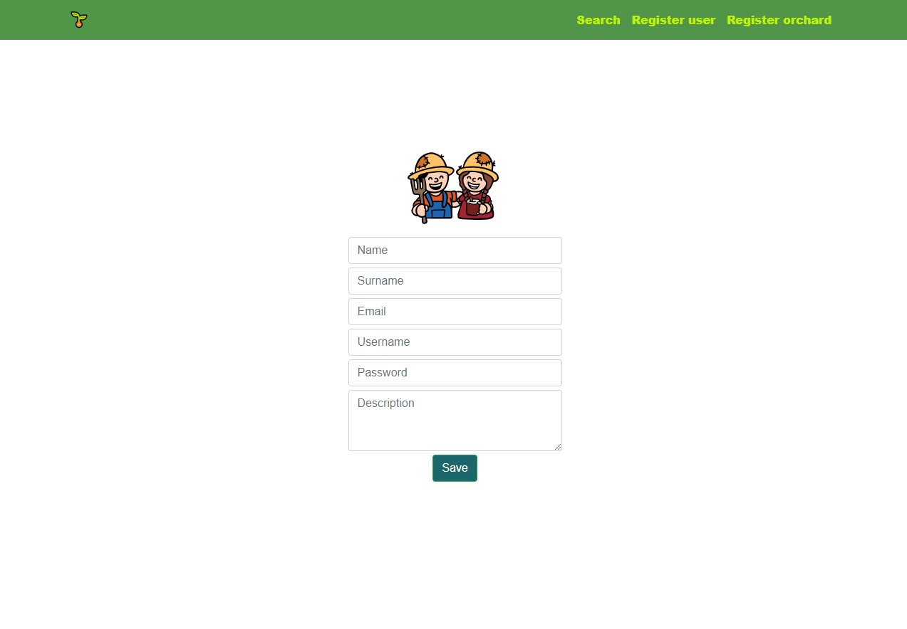

# Grow.it: grow more... buy less

                                                    

## Target

Grow it is a collaborative urban orchards platform. Intended to connect people having space to grow with people with time to attend and possibly share harvests between  all of them.

-------------------------------------------------------

## Functional description

This application allows to connect people through a growing community of owned plantations. Once a user is registered, he can create an orchard or collaborate in another ones, look for consulting, share the harvest surplus, etc.

Contacts between users are possible by mail.

### Screenshots

[Surge](http://growit.surge.sh)

-------------------------------------------------------

## Technical description

* HTML5
* CSS3
* Javascript
* Node
* MongoDB
* Mongoose
* React

### General structure

### Data model

#### Client app

#### API client
HTTP connector client using [request-promise](https://github.com/request/request-promise)

#### API server
3 layers separation:
* Routes/handlers: I/O layer
* Logic: implement business logic
* Models: define Mongoose schemas

API reference detailed in [API server](https://github.com/csd0/REST-API-Server)

-------------------------------------------------------

### Sprint plan

|    Fecha   |  Planificación  |
|------------|-----------------|
| 2018-03-09 | Kick-off meeting | 
| 2018-03-12 | Documented README.MD, with datamodel, mockup & sprint plan | 
| 2018-03-14 | Doc improvements, design & build front-end | 
| 2018-03-16 | Read-only appp deployed to surge, no-funcional React components implementation, API server y MongoDB defined| 
| 2018-03-19 | React functionality: basic funtions. TDD API testing | 
| 2018-03-21 | React functionality: advanced funtions & bug fixes. Functional connection between entre Front-end, API Server and MongoDB | 
| 2018-03-23 | Basic functional application deployed | 
| 2018-03-28 | Improvements, bug testing, hotfixes | 
| 2018-03-30 | Demo day | 

-------------------------------------------------------

### Links
* Gestión de tareas en [Trello](https://trello.com/b/tXKaT7at)
* [Repositorio](https://github.com/csd0/Grow.it) del proyecto
* [API server](https://github.com/csd0/REST-API-Server)
* [Surge](http://growit.surge.sh)
